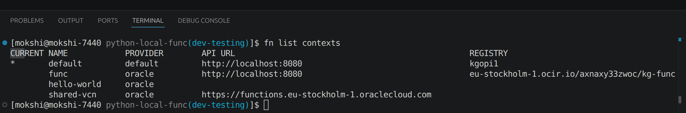
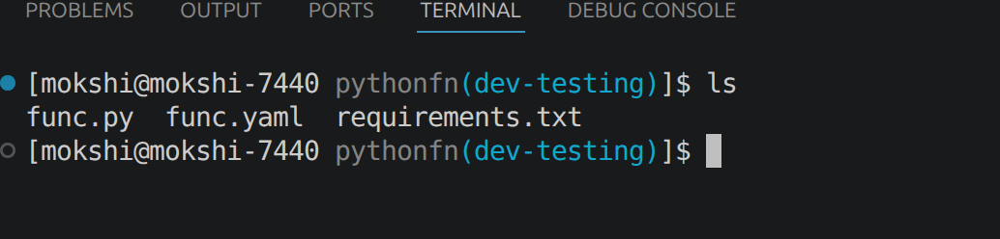
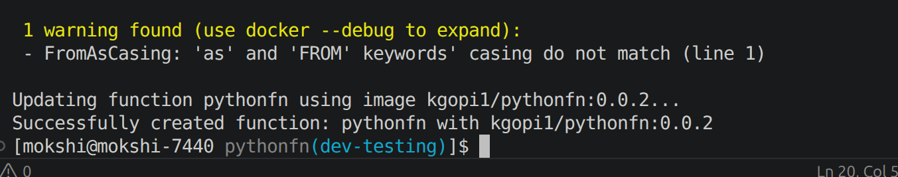

Python Function Setup

[Python fn deployment guide Ref](https://github.com/fnproject/tutorials/blob/master/python/intro/README.md)

Step1: ```fn update context registry your-docker-hub-user-name```



Step2: 
```fn init --runtime python pythonfn```

Step3: ```cd pythonfn && ls ``` 



Step4 : 
```fn create app pythonapp```

Step5 : 
```fn --verbose deploy --app pythonapp --local```



Step6:

```fn list apps ```


step7 :
```fn list functions pythonapp```

step8:
``` fn invoke pythonapp pythonfn ```

``` echo -n '{"name":"Bob"}' | fn invoke pythonapp pythonfn --content-type application/json ```

```echo -n '{"name":"Gopi"}' | fn invoke pythonapp pythonfn --content-type application/json ```


Step9: 
```fn inspect function pythonapp pythonfn```

Select InvokeEndpoint

Step10:
```curl -X "POST" -H "Content-Type: application/json" http://localhost:8080/invoke/01M0QK356ENG8G00GZJ0000002```

```curl -X "POST" -H "Content-Type: application/json" https://5xopbvjiuha.functions.eu-stockholm-1.oci.oraclecloud.com/20181201/functions/ocid1.fnfunc.oc1.eu-stockholm-1.amaaaaaax6kdgtyaflsr24wzbu77t5hw2w5qtdia7nbhtcsw7xce6n6b6clq/actions/invoke```

